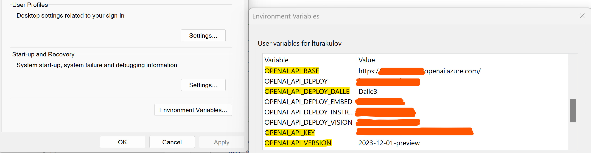

# Image generation with Azure OpenAI DALL-E 3
DALL-E 3 is a Generative AI model from OpenAI, which can produce images based on your textual input (prompt). You will find a Jupyter notebook in this repo, that utilises Azure OpenAI deployment of DALL-E 3 to generate caricature image of a famous Disney character.

To build this demo, I used the latest version of OpenAI Python SDK - v1.x. To upgrade your _openai_ Python package, please use the following pip command:
```
pip install --upgrade openai
```

## Table of contents:
- [Part 1: Configuring solution environment](https://github.com/LazaUK/AOAI-DALL-E-3-SDKv1/tree/main?tab=readme-ov-file#part-1-configuring-solution-environment)
- [Part 2: Generating and visualising required image](https://github.com/LazaUK/AOAI-DALL-E-3-SDKv1/tree/main?tab=readme-ov-file#part-2-generating-and-visualising-required-image)

## Part 1: Configuring solution environment
1. To use API key authentication, assign the API endpoint name, version and key, along with the Azure OpenAI deployment name of DALL-E 3 model to **OPENAI_API_BASE**, **OPENAI_API_VERSION**, **OPENAI_API_KEY** and **OPENAI_API_DEPLOY_DALLE** environment variables respectively.

>**Note**: If you want to use the Entra ID (former Azure Active Directory) authentication instead, you may find some implementation options [here](https://github.com/LazaUK/AOAI-EntraIDAuth-SDKv1).
2. Install the required Python packages, by using the **pip** command and the provided requirements.txt file.
```
pip install -r requirements.txt
```

## Part 2: Generating and visualising required image
1. Connection with the backend Azure OpenAI service is established through the _openai_ Python SDK v1. Current implementation passes the Azure OpenAI endpoint's API key as a parameter value of the AzureOpenAI class. If necessary, you can switch to the Entra ID authentication instead.
``` Python
client = AzureOpenAI(
    api_version = AOAI_API_VERSION,
    api_key = AOAI_API_KEY,
    azure_endpoint = AOAI_API_BASE,
)
```
2. We define then a helper function, that would call deployment name of our DALL-E 3 model in Azure OpenAI and return URL of generated image.
``` Python
def image_generator(prompt):
    # Generate image with DALL-E 3
    response = client.images.generate(
        model = AOAI_DEPLOYMENT,
        prompt = prompt,
    )
    
    # Extract image URL
    json_response = json.loads(response.model_dump_json())
    image_url = json_response["data"][0]["url"]
    return image_url
```
3. We can call then our helper function with our image prompt, e.g. "Caricature picture of a Mickey Mouse with a hat".
4. If successful, we should be able to download our image with _Pillow_ and visualise in default graphic editor.
``` Python
image = Image.open(requests.get(image_url, stream=True).raw)
image.show()
```
5. Below is an example from my run. Your output may look different. 

